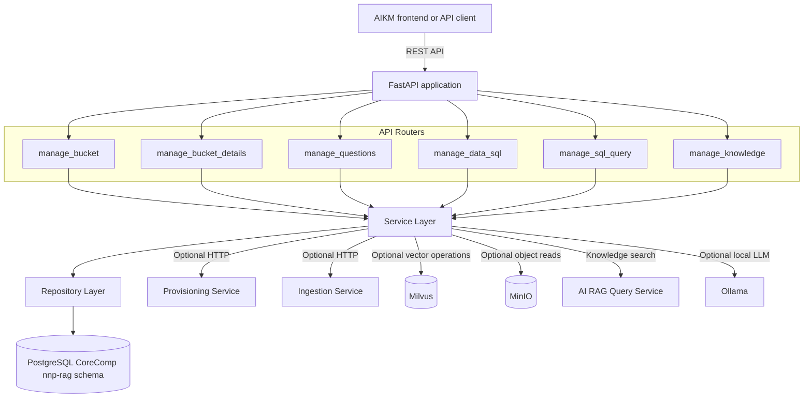
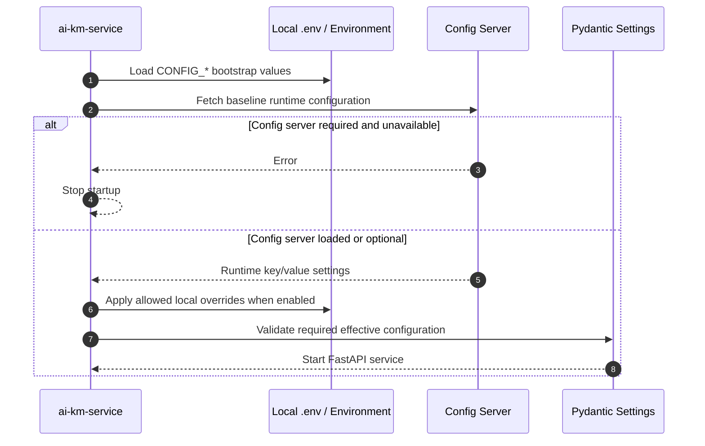

# PICC-AIKM-AIKM-backend

[](https://www.python.org/)
[](https://fastapi.tiangolo.com/)
[](https://www.postgresql.org/)
[](https://docs.docker.com/compose/)
[](LICENSE)

FastAPI backend service for the AI Knowledge Management module of the Nubo Native Platform. The service exposes CoreComp CRUD APIs for knowledge buckets, bucket documents, saved questions, database metadata, SQL query metadata, and knowledge-search asset proxying over the configured PostgreSQL schema.

Part of the **AI Knowledge Management (AIKM)** area of the **Nubo Native Platform (NNP)**.

---

## Table of Contents

- [Overview](#overview)
- [Key Features](#key-features)
- [Architecture and Low-Level Design](#architecture-and-low-level-design)
  - [System Component Architecture](#system-component-architecture)
  - [Configuration Loading Flow](#configuration-loading-flow)
- [Technology Stack](#technology-stack)
- [Quick Start and Local Development](#quick-start-and-local-development)
  - [Prerequisites](#prerequisites)
  - [Configuration Setup](#configuration-setup)
  - [Running via Docker Compose](#running-via-docker-compose)
  - [Running via Python Virtual Environment](#running-via-python-virtual-environment)
  - [Running Tests](#running-tests)
- [Configuration Reference](#configuration-reference)
- [API Documentation](#api-documentation)
- [Security and Compliance](#security-and-compliance)
- [Contributing and Community](#contributing-and-community)
- [License](#license)

---

## Overview

`PICC-AIKM-AIKM-backend` provides the `ai-km-service` FastAPI application. It manages metadata for AI knowledge-management workflows, including buckets, bucket details, saved questions, database connection metadata, saved SQL queries, and knowledge-search image proxying.

The service reads runtime configuration from a config server and can optionally allow local `.env` overrides for development. PostgreSQL stores the CoreComp `nnp-rag` schema data. Optional integrations include downstream provisioning, ingestion, Milvus, MinIO, Ollama, OpenAI-compatible embeddings, Vanna NL-to-SQL, and the AI RAG query service.

---

## Key Features

1. **Knowledge Bucket Management**
   - Create, update, and fetch knowledge buckets by account.
   - Maintain bucket-level metadata used by the knowledge-management workflow.
   - Coordinate optional asynchronous bucket provisioning through a downstream provisioning service.

2. **Bucket Detail and Document Metadata Management**
   - Create, update, and fetch bucket detail records.
   - Track document ingestion metadata and ingestion callback updates.
   - Support downstream ingestion orchestration when enabled by configuration.

3. **Question and Database Metadata APIs**
   - Manage saved question details for one or more buckets.
   - Manage database and SQL metadata used by NL-to-SQL workflows.
   - Validate request payloads before persistence.

4. **Knowledge Search Asset Proxy**
   - Calls the configured RAG query service for knowledge search.
   - Rewrites image asset URLs so clients can load protected MinIO assets through this backend.
   - Avoids exposing direct object-storage URLs to browsers.

5. **Operational Health and Request Tracing**
   - Provides lightweight liveness and database-backed readiness checks.
   - Adds `X-Request-ID` response headers for request correlation.
   - Logs unhandled request failures with a short request identifier.

---

## Architecture and Low-Level Design

### System Component Architecture



### Configuration Loading Flow



---

## Technology Stack

| Component | Technology | Version / Spec |
| :--- | :--- | :--- |
| **Runtime** | Python | 3.13 in `Dockerfile.api` |
| **API Framework** | FastAPI, Uvicorn | Installed from `requirements-api.txt` |
| **Configuration** | Pydantic Settings, config server, `.env` | Environment-driven |
| **Persistence** | PostgreSQL, psycopg2 | PostgreSQL 16 in `compose.yml` |
| **Validation Models** | Pydantic | Request and response models |
| **Outbound HTTP** | httpx, requests | Provisioning, ingestion, RAG service calls |
| **Vector Database Client** | pymilvus | Milvus collection operations |
| **Object Storage Client** | MinIO Python SDK | Knowledge-search image assets |
| **LLM and Embeddings** | OpenAI SDK, LangChain, sentence-transformers, Ollama | Configurable local/public modes |
| **NL-to-SQL** | Vanna, PGVector dependencies | SQL query generation support |
| **Testing** | pytest, FastAPI TestClient | Tests under `tests/` |
| **Containerization** | Docker, Docker Compose | `Dockerfile.api`, `compose.yml` |

---

## Quick Start and Local Development

### Prerequisites

- **Python 3.13** recommended for parity with `Dockerfile.api`.
- **Docker Desktop** or Docker Engine with Docker Compose.
- **PostgreSQL client tools** if loading `db/schema.sql` into an existing database manually.
- Access to a valid config server, or a local `.env` with all required values and `CONFIG_SERVER_REQUIRED=false`.

### Configuration Setup

Create a local `.env` from the template:

```bash
copy .env.sample .env
```

On Linux or macOS:

```bash
cp .env.sample .env
```

Update the copied `.env` with placeholders appropriate for your environment. Do not commit real credentials, tokens, internal hostnames, or private URLs.

For a local-only run without a reachable config server, use the following pattern and fill every required runtime key with safe local values:

```env
CONFIG_SERVER_URL=<CONFIG_SERVER_URL>
CONFIG_APP_NAME=<CONFIG_APP_NAME>
CONFIG_PROFILE=<CONFIG_PROFILE>
CONFIG_TAG=<CONFIG_TAG>
CONFIG_SERVER_TIMEOUT=5
CONFIG_SERVER_REQUIRED=false
ALLOW_LOCAL_CONFIG_OVERRIDES=true

API_HOST=0.0.0.0
API_PORT=8000
API_PUBLIC_URL=http://localhost:8000
LOG_LEVEL=INFO

PG_HOST=localhost
PG_PORT=5432
PG_DB=<POSTGRES_DATABASE>
PG_USER=<POSTGRES_USER>
PG_PASSWORD=<POSTGRES_PASSWORD>
PG_SCHEMA=<POSTGRES_SCHEMA>

MODEL_TYPE=local
PROVISION_ENABLED=false
INGESTION_ENABLED=false
RAG_QUERY_SERVICE_URL=<RAG_QUERY_SERVICE_URL>
```

When `MODEL_TYPE` is not `local`, the service also requires a valid `OPENAI_API_KEY`.

### Running via Docker Compose

Docker Compose starts PostgreSQL and the API. PostgreSQL loads `db/schema.sql` on the first run of the database volume.

```bash
docker compose up --build
```

The API listens on:

```text
http://localhost:8000
```

Check liveness:

```bash
curl http://localhost:8000/health
```

Check database readiness:

```bash
curl http://localhost:8000/health/deep
```

Stop the stack:

```bash
docker compose down
```

To recreate the local database from `db/schema.sql`, remove the Compose volume before starting again:

```bash
docker compose down -v
docker compose up --build
```

### Running via Python Virtual Environment

Use this option when PostgreSQL and any needed downstream services are already available.

```bash
python -m venv .venv
.venv\Scripts\activate
python -m pip install --upgrade pip
pip install -r requirements-api.txt
python run_api.py
```

On Linux or macOS:

```bash
python -m venv .venv
source .venv/bin/activate
python -m pip install --upgrade pip
pip install -r requirements-api.txt
python run_api.py
```

For a new local PostgreSQL database, load the schema before starting the API:

```bash
psql "<POSTGRES_CONNECTION_STRING>" -v ON_ERROR_STOP=1 -f db/schema.sql
```

### Running Tests

Install the API and development dependencies and run pytest:

```bash
pip install -r requirements-api.txt -r requirements-dev.txt
pytest
```

The test suite patches the FastAPI lifespan database pool so unit/API tests do not require a live PostgreSQL connection.

---

## Configuration Reference

Runtime settings are loaded from the config server first, then from local overrides when `ALLOW_LOCAL_CONFIG_OVERRIDES=true` or when the config server is optional and unavailable.

| Environment Variable | Required | Description |
| :--- | :---: | :--- |
| `CONFIG_SERVER_URL` | Yes | Config server base URL. Use `<CONFIG_SERVER_URL>` in templates. |
| `CONFIG_APP_NAME` | Yes | Config application name for this service. |
| `CONFIG_PROFILE` | Yes | Config profile to fetch. |
| `CONFIG_TAG` | Yes | Config version/tag to fetch. |
| `CONFIG_SERVER_TIMEOUT` | Yes | Config server request timeout in seconds. |
| `CONFIG_SERVER_REQUIRED` | Yes | Set `true` for environments where config server is mandatory. |
| `ALLOW_LOCAL_CONFIG_OVERRIDES` | Yes | Allows non-empty local runtime values to override fetched config. |
| `API_HOST` | Yes | Host interface for Uvicorn. |
| `API_PORT` | Yes | HTTP port for the FastAPI service. |
| `API_PUBLIC_URL` | Recommended | Public base URL used when rewriting proxied asset URLs. |
| `LOG_LEVEL` | Yes | Application log level. |
| `PG_HOST` | Yes | PostgreSQL host. |
| `PG_PORT` | Yes | PostgreSQL port. |
| `PG_DB` | Yes | PostgreSQL database name. |
| `PG_USER` | Yes | PostgreSQL username. |
| `PG_PASSWORD` | Yes | PostgreSQL password. Must never be committed with a real value. |
| `PG_SCHEMA` | Yes | PostgreSQL schema containing AIKM tables. |
| `PG_POOL_MIN` | Yes | Minimum PostgreSQL connection pool size. |
| `PG_POOL_MAX` | Yes | Maximum PostgreSQL connection pool size. |
| `USER_HEADER` | Yes | Request header used to resolve the portal user id. |
| `DEFAULT_USER` | Yes | Fallback user id when the request header is absent. |
| `MILVUS_HOST` | Yes | Milvus host for collection operations. |
| `MILVUS_PORT` | Yes | Milvus port. |
| `MILVUS_DB_NAME` | Yes | Milvus database name. |
| `PROVISION_ENABLED` | Conditional | Enables provisioning-service calls. |
| `PROVISION_SERVICE_URL` | Conditional | Required when `PROVISION_ENABLED=true`. |
| `PROVISION_DELETE_URL` | Conditional | Required when `PROVISION_ENABLED=true`. |
| `INGESTION_ENABLED` | Conditional | Enables ingestion-service calls. |
| `INGESTION_SERVICE_URL` | Conditional | Required when `INGESTION_ENABLED=true`. |
| `INGESTION_DELETE_URL` | Conditional | Required when `INGESTION_ENABLED=true`. |
| `CALLBACK_BASE_URL` | Yes | Externally reachable callback base URL. |
| `HTTP_TIMEOUT` | Yes | Outbound HTTP timeout in seconds. |
| `MODEL_TYPE` | Yes | Use `local` for local LLM mode. Non-local mode requires `OPENAI_API_KEY`. |
| `OPENAI_API_KEY` | Conditional | Required when `MODEL_TYPE` is not `local`. |
| `MINIO_HOST` | Yes | MinIO endpoint for image asset proxying. |
| `MINIO_ROOT_USER` | Yes | MinIO access user. |
| `MINIO_ROOT_PASSWORD` | Yes | MinIO password. Must never be committed with a real value. |
| `MINIO_BUCKET` | Yes | Default object-storage bucket. |
| `OLLAMA_BASE_URL` | Yes | Ollama base URL for local LLM paths. |
| `RAG_QUERY_SERVICE_URL` | Yes | Base URL of the AI RAG query service. |
| `LLM_MODEL` | Yes | LLM model name used by SQL generation paths. |

See `src/config/settings.py` for the complete validated settings list.

---

## API Documentation

Once the service is running, API documentation and health endpoints are available at:

- **Swagger UI**: [http://localhost:8000/docs](http://localhost:8000/docs)
- **OpenAPI JSON**: [http://localhost:8000/openapi.json](http://localhost:8000/openapi.json)
- **Liveness**: [http://localhost:8000/health](http://localhost:8000/health)
- **Readiness**: [http://localhost:8000/health/deep](http://localhost:8000/health/deep)

Primary API groups:

```text
GET  /manageBucket/getDetails/{account_id}
POST /manageBucket/createBucket
PUT  /manageBucket/updateBucket/{id}
POST /manageBucket/provisionCallback

GET  /manageBucketDetails/getDetails/{bucket_id}
POST /manageBucketDetails/createBucketDetails
PUT  /manageBucketDetails/updateBucketDetails/{id}
POST /manageBucketDetails/ingestionCallback

GET  /manageQuestions/getDetails?bucketIds=<id1>,<id2>
POST /manageQuestions/addQDetails
PUT  /manageQuestions/updateQDetails/{id}

GET  /manageDataSql/getDetails?bucketIds=<id1>,<id2>
POST /manageDataSql/addDBDetails
PUT  /manageDataSql/updateDBDetails/{id}
POST /manageDataSql/addSQLDetails
PUT  /manageDataSql/updateSQLDetails/{id}

POST /manageKnowledge/search
GET  /manageKnowledge/assets/image
```

---

## Security and Compliance

This repository follows these documentation and runtime safety rules:

- **No committed secrets**: Do not commit passwords, API keys, access tokens, private URLs, internal hostnames, or production `.env` files.
- **Placeholder documentation**: Public examples must use placeholders such as `<CONFIG_SERVER_URL>`, `<POSTGRES_PASSWORD>`, and `<RAG_QUERY_SERVICE_URL>`.
- **Local overrides only for development**: Use `ALLOW_LOCAL_CONFIG_OVERRIDES=true` only for local development and controlled test environments.
- **Config validation on startup**: Required configuration values are validated before the API starts serving requests.
- **Request correlation**: Non-health requests include an `X-Request-ID` response header for log tracing.
- **Dependency review**: Review changes to `requirements-api.txt` before merging.

---

## Contributing and Community

Contributions are welcome under the **Apache 2.0 License**.

- Guidelines: [CONTRIBUTING.md](CONTRIBUTING.md)
- Code of Conduct: [CODE_OF_CONDUCT.md](CODE_OF_CONDUCT.md)
- Development Guide: [DEVELOPMENT_GUIDELINES.md](DEVELOPMENT_GUIDELINES.md)
- Deployment and User Manual: [USER_MANUAL_AND_DEPLOYMENT_GUIDE.md](USER_MANUAL_AND_DEPLOYMENT_GUIDE.md)
- Maintainers: [MAINTAINERS.md](MAINTAINERS.md)

---

## License

Licensed under the **Apache License, Version 2.0**. See the [LICENSE](LICENSE) file for details.
